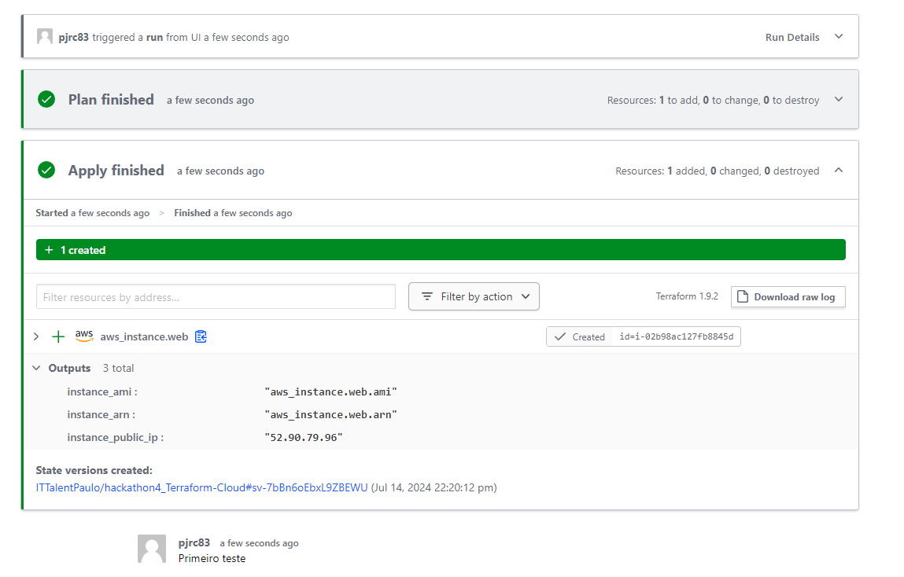
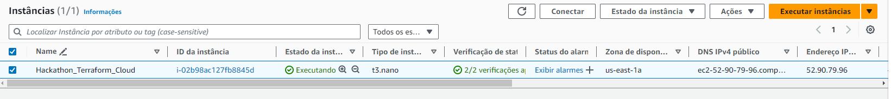
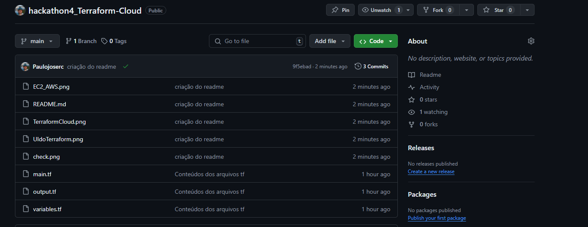

# 4º HACKATHON It Talent

Terraform Cloud

Este repositório todos os passos que foram utilizados para integração dos terraform cloud com aws subindo um EC2.

## Os prints e arquivos

- `main.tf`: arquivo principal que será usado para o input de dados para o módulo.
- `output.tf`: Script que determina a saída de informações pós-execução no caso   vai mostra ip público da máquina criada
- `variables.tf`: Arquivo com variáveis para execução no Terraform.
- Print instancia do terraform sendo executada com excetor! 
   
    
- Prints mostrando a execução do EC2 na AWS.
  

- Print do check.
  
 